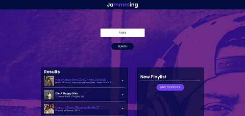

# Jammming

Jammming was the capstone project that was completed as part of Codecademy's Create a Front-End App with React skill path, in which we were instructed to build a React App for custom playlists that combines multiple components, interactive search functionality, and requests to the Spotify API. The requirements were to utilize React to build a UI for the site that would allows users to search the Spotify library, create a custom playlist, then save it to their Spotify account.

This project was broken up into the 7 main sections below, where each stage built upon the previously implemented functionality:

1. Create 6 Static Components:
    - App (default)
    - SearchBar
    - SearchResults
    - Playlist
    - TrackList
    - Track
2. Pass Search Results and Other Information to Child Components
3. Create Methods to Add & Remove Tracks from a Playlist
4. Create a Method to Change the Name of a Playlist
5. Create a Method that Saves the Playlist to a User's Account
6. Interact with the Spotify API as Follows:
    - Create a Method to Obtain a Spotify Access Token
    - Enable the Search Bar to Initiate a Spotify Search Request
    - Create & Save a User's Playlist
7. Deploy the App

Project Extensions:

Additionally, I chose to implement a few of the suggested project extensions which are as follows:

* Allow users to trigger a search by pressing “Enter” on the keyboard, as opposed to manually clicking the button.
* Include preview samples for each track.
* Add a loading screen while playlist is saving.

## Table of Contents

- [Technologies](#technologies)
- [Screenshots](#screenshots)
- [Status](#status)

## Technologies

This project was created with:

- JavaScript ES6
- Node.js version: 14.15.1
- Create React App version: 4.0.3

## Screenshots

## Status

This project is in progress.